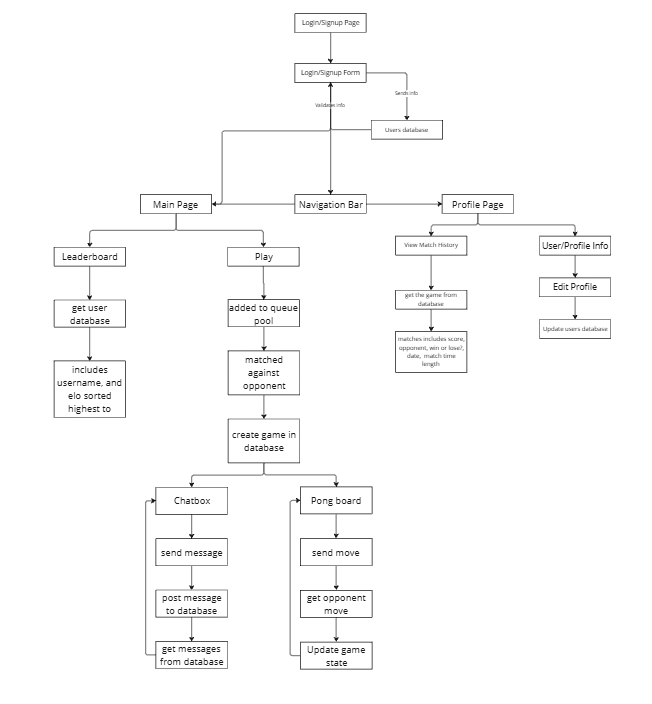
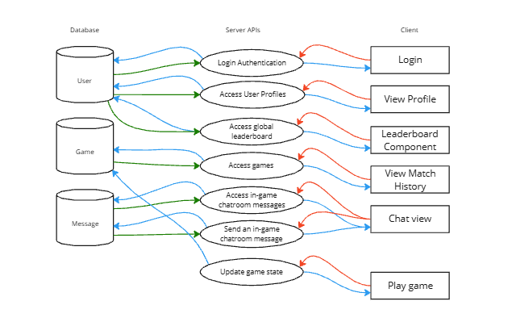

# Multiplayer Ping Pong
**Group Members:** Munir Emam, Rusheel Chande, Dhruv Ashok, Alex Han  
**Web App URL:** [https://pong441.onrender.com/](https://pong441.onrender.com/)  
**Class Project:** INFO 441 - Server-Side Development, Fall Quarter 2024  

---

## **Project Overview**
This is a **full-stack web application** that allows users to play **real-time multiplayer Pong** over the internet. The application supports **matchmaking based on ELO rankings**, a **global leaderboard**, and **real-time chat functionality**.

It is built with a **React.js frontend, a Node.js/Express backend, and a MongoDB database**. Authentication is handled via **Microsoft Azure Active Directory (Azure AD)**, ensuring that only **University of Washington (UW) students** can log in and play. **WebSockets are used for real-time game updates**, ensuring smooth paddle movement, ball physics, and scoring updates.

---

## **Architecture**


The application follows a **client-server architecture** where the **frontend (React.js) communicates with the backend (Node.js/Express)** through **REST API requests and WebSockets**. The **backend manages authentication, matchmaking, and game state**, while the **MongoDB database stores user information, game history, and chat messages**.

---

## **Data Flow**


When a user logs in via **Azure AD**, their **session is managed using Express sessions**. Once authenticated, they can **join the matchmaking queue**. When two players with similar **ELO rankings** are found, a **new game session is created**, and **WebSockets handle real-time game synchronization**. The **game server ensures fairness by maintaining the authoritative game state**, and **after the match**, the results are stored in **MongoDB**, updating the **ELO rankings** and **leaderboard**.

---

## **Technology Stack**
### **Frontend**
- **React.js** - Component-based UI rendering
- **React Router** - Client-side navigation
- **WebSockets (`ws`)** - Real-time communication
- **Bootstrap** - UI styling

### **Backend**
- **Node.js with Express.js** - REST API and WebSocket server
- **MongoDB with Mongoose** - Database for storing users, games, and chat messages
- **Express WebSockets (`express-ws`)** - WebSocket handling for game state synchronization
- **MSAL Node.js (`msal-node-wrapper`)** - Microsoft Azure AD authentication

### **Infrastructure**
- **Render.com** - Hosting for both frontend and backend
- **MongoDB Atlas** - Cloud-hosted database
- **Dotenv** - Environment variable management

---

## **Endpoints and API Reference**
The backend exposes the following **REST API endpoints**:

### **User Authentication (`/user`)**
| Method | Endpoint          | Description |
|--------|------------------|-------------|
| **GET** | `/user/login` | Authenticates a user via Azure AD |
| **GET** | `/user/profile` | Retrieves user profile information (username, ELO, match history) |
| **POST** | `/user/updateElo` | Updates the ELO ranking for a user after a match |

### **Game Management (`/games`)**
| Method | Endpoint          | Description |
|--------|------------------|-------------|
| **GET** | `/games/list` | Retrieves all games played by the logged-in user |
| **POST** | `/games` | Creates a new game entry after a match ends |

### **Real-Time Chat (`/messages`)**
| Method | Endpoint          | Description |
|--------|------------------|-------------|
| **GET** | `/messages` | Retrieves chat messages for a specific game |
| **POST** | `/messages` | Sends a new message in an active game chat room |

### **Leaderboard (`/leaderboard`)**
| Method | Endpoint          | Description |
|--------|------------------|-------------|
| **GET** | `/leaderboard` | Fetches the list of users ranked by their ELO score |

### **Matchmaking (`/matchmaking`)**
| Method | Endpoint          | Description |
|--------|------------------|-------------|
| **POST** | `/matchmaking/find` | Finds an opponent with similar ELO using a priority queue |

---

## **Database Schemas**
The following schemas define the **MongoDB database structure**, storing **user data, game history, and chat messages**.

### **User Schema (`users` Collection)**
```json
{
    "user_id": "ObjectId",
    "username": "String (Unique)",
    "elo": "Number",
    "createdAt": "Date",
    "updatedAt": "Date"
}

- username: The unique identifier for the user.
- elo: The user's **ELO rating**, used for matchmaking.
- createdAt, updatedAt: Track when the user was created or last updated.
