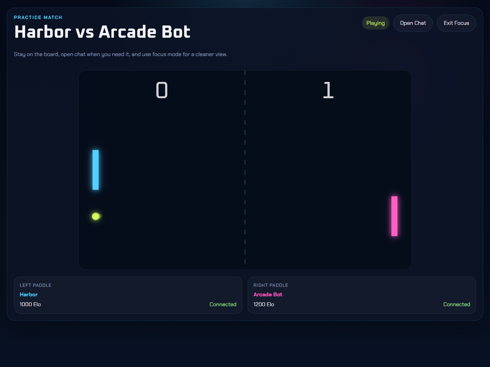
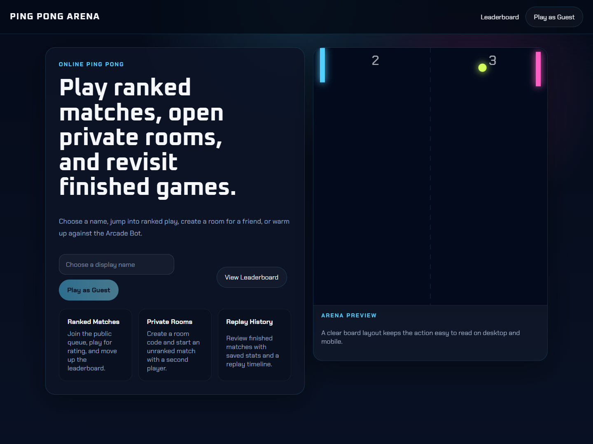
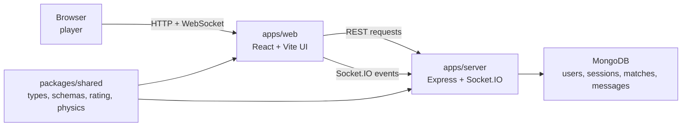
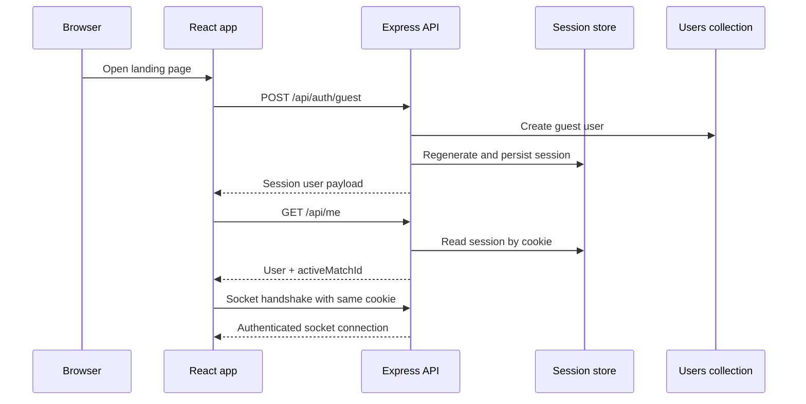
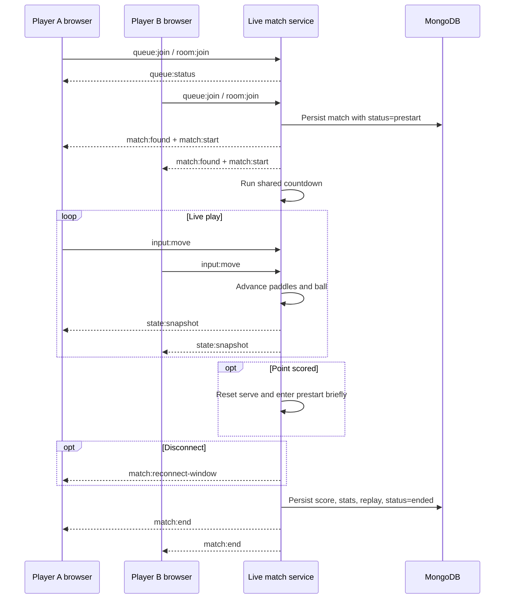
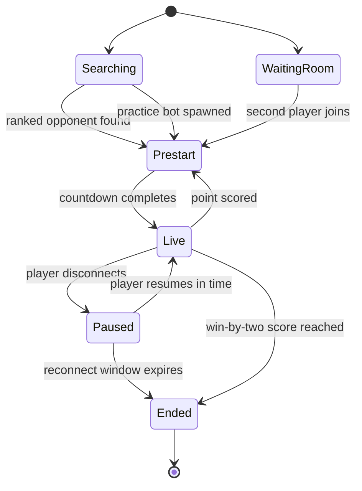
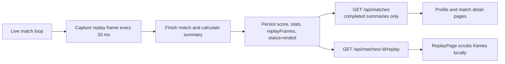

# Ping Pong Arena

https://ping-pong-arena.onrender.com/



Ping Pong Arena is an online ping pong game with ranked matches, private rooms, practice mode, in-match chat, reconnect handling, match history, and replay viewing.

## Highlights

- Ranked public matches with leaderboard updates
- Private room codes for direct matches
- Practice matches against the Arcade Bot
- Saved match summaries and replay scrubbing
- Guest sessions for quick entry

## Screens



Static diagram exports are also available here:

- [Architecture PNG](docs/assets/diagrams/architectural.png)
- [Data flow PNG](docs/assets/diagrams/data_flow.png)

## Repo Layout

- `apps/web` contains the React interface and match viewer.
- `apps/server` contains the HTTP API, Socket.IO layer, and live match engine.
- `packages/shared` contains shared types, schemas, rating helpers, and physics rules.
- `docs/` contains diagrams, screenshots, and supporting documentation.

## How It Works

The client renders the board and sends player input. The server advances the match, validates state changes, handles reconnect windows, and saves completed results so both players stay in sync.

Finished matches are stored with summaries, stats, chat history, and replay frames. The profile page only shows completed results, while live matches stay attached to the current session until they end.

### Monorepo Shape


```mermaid
flowchart LR
  Browser["Browser<br/>player"]
  Web["apps/web<br/>React + Vite UI"]
  Shared["packages/shared<br/>types, schemas, rating, physics"]
  Server["apps/server<br/>Express + Socket.IO"]
  Mongo["MongoDB<br/>users, sessions, matches, messages"]

  Browser -->|"HTTP + WebSocket"| Web
  Web -->|"REST requests"| Server
  Web -->|"Socket.IO events"| Server
  Shared --> Web
  Shared --> Server
  Server --> Mongo
```

Source: [docs/diagrams/monorepo-overview.mmd](docs/diagrams/monorepo-overview.mmd)

### Session And Request Bootstrap


```mermaid
sequenceDiagram
  participant Browser
  participant Web as React app
  participant API as Express API
  participant Sessions as Session store
  participant Users as Users collection

  Browser->>Web: Open landing page
  Web->>API: POST /api/auth/guest
  API->>Users: Create guest user
  API->>Sessions: Regenerate and persist session
  API-->>Web: Session user payload
  Web->>API: GET /api/me
  API->>Sessions: Read session by cookie
  API-->>Web: User + activeMatchId
  Web->>API: Socket handshake with same cookie
  API-->>Web: Authenticated socket connection
```

Source: [docs/diagrams/session-request-flow.mmd](docs/diagrams/session-request-flow.mmd)

### Live Match Flow


```mermaid
sequenceDiagram
  participant PlayerA as Player A browser
  participant PlayerB as Player B browser
  participant Server as Live match service
  participant DB as MongoDB

  PlayerA->>Server: queue:join / room:join
  Server-->>PlayerA: queue:status
  PlayerB->>Server: queue:join / room:join
  Server->>DB: Persist match with status=prestart
  Server-->>PlayerA: match:found + match:start
  Server-->>PlayerB: match:found + match:start
  Server->>Server: Run shared countdown
  loop Live play
    PlayerA->>Server: input:move
    PlayerB->>Server: input:move
    Server->>Server: Advance paddles and ball
    Server-->>PlayerA: state:snapshot
    Server-->>PlayerB: state:snapshot
  end
  opt Point scored
    Server->>Server: Reset serve and enter prestart briefly
  end
  opt Disconnect
    Server-->>PlayerA: match:reconnect-window
  end
  Server->>DB: Persist score, stats, replay, status=ended
  Server-->>PlayerA: match:end
  Server-->>PlayerB: match:end
```

Source: [docs/diagrams/socket-match-flow.mmd](docs/diagrams/socket-match-flow.mmd)

### Match Lifecycle


```mermaid
stateDiagram-v2
  [*] --> Searching
  [*] --> WaitingRoom
  Searching --> Prestart: ranked opponent found
  Searching --> Prestart: practice bot spawned
  WaitingRoom --> Prestart: second player joins
  Prestart --> Live: countdown completes
  Live --> Prestart: point scored
  Live --> Paused: player disconnects
  Paused --> Live: player resumes in time
  Paused --> Ended: reconnect window expires
  Live --> Ended: win-by-two score reached
  Ended --> [*]
```

Source: [docs/diagrams/match-lifecycle.mmd](docs/diagrams/match-lifecycle.mmd)

### Replay And History Flow


```mermaid
flowchart LR
  Live["Live match loop"] --> Capture["Capture replay frame every 33 ms"]
  Capture --> Finish["Finish match and calculate summary"]
  Finish --> Persist["Persist score, stats, replayFrames, status=ended"]
  Persist --> History["GET /api/matches<br/>completed summaries only"]
  Persist --> Replay["GET /api/matches/:id/replay"]
  Replay --> ReplayPage["ReplayPage scrubs frames locally"]
  History --> Profile["Profile and match detail pages"]
```

Source: [docs/diagrams/replay-history-flow.mmd](docs/diagrams/replay-history-flow.mmd)

## Tech Stack

| Layer        | Technology                                                     |
| ------------ | -------------------------------------------------------------- |
| Frontend     | React 19, TypeScript, Vite, React Router, Socket.IO client     |
| Backend      | Express, TypeScript, Socket.IO, express-session, connect-mongo |
| Data         | MongoDB, Mongoose                                              |
| Shared logic | Zod, shared TypeScript types, rating helpers, physics helpers  |
| Quality      | ESLint, Prettier, Vitest, Playwright, GitHub Actions           |
| Local infra  | Docker Compose for MongoDB                                     |

## Project Structure

```text
.
|- apps/
|  |- server/        Express API, Socket.IO, live match service, integration tests
|  \- web/           React UI, page routes, canvas rendering, browser tests
|- packages/
|  \- shared/        Shared types, schemas, physics, rating helpers
|- docs/
|  |- assets/        Screenshots and static diagram exports
|  \- diagrams/      Mermaid source files for architecture diagrams
|- Dockerfile
|- compose.yaml
\- package.json
```

## Getting Started

1. Copy `.env.example` to `.env`.
2. Install dependencies with `npm install`.
3. Run `npm run dev`.
4. Open `http://localhost:5173`.
5. Enter a display name and start a practice match, ranked queue, or private room.

`npm run dev` starts Docker Mongo first, builds the shared package, then runs the shared watcher, backend, and frontend together.

If Docker is unavailable, remove `MONGO_URI` from `.env` and the server will fall back to an in-memory MongoDB instance. That mode is useful for quick local work, but sessions and history disappear when the process stops.

## Scripts

| Command                | What it does                                                                  |
| ---------------------- | ----------------------------------------------------------------------------- |
| `npm run dev`          | Starts Docker Mongo, the shared watcher, the server, and the web app          |
| `npm run build`        | Builds shared, web, and server workspaces                                     |
| `npm run lint`         | Runs type checks, ESLint, and Prettier checks                                 |
| `npm test`             | Runs shared, server, and web test suites                                      |
| `npm run e2e`          | Runs the Playwright browser flows                                             |
| `npm run smoke:prod`   | Boots the compiled production server and checks health plus the SPA shell     |
| `npm run smoke:deploy` | Verifies guest auth and a live practice match against a deployed HTTPS origin |
| `npm run audit`        | Runs an npm dependency audit                                                  |
| `npm run clean`        | Removes generated build and test artifacts                                    |
| `npm start`            | Starts the built server in production mode                                    |

## Testing

Run `npm run check` from the repo root before shipping changes. That covers type checks, linting, unit tests, integration tests, the production build, and the dependency audit.

Coverage includes shared helpers, server match flows, web page rendering, and browser flows for guest login, practice matches, private rooms, invalid routes, invalid room codes, and a mobile landing pass.

## Deployment Notes

The production setup is straightforward, but v1 has an important constraint:

- keep Render on a single app instance because live queue, room, and match state are held in process memory
- deploy during a quiet window because restarts can interrupt active matches
- use a real `MONGO_URI` and `SESSION_SECRET`
- set `NODE_ENV=production`
- run `npm start`

In production, the Express server serves the built frontend and API from the same origin. For the full Render + Mongo Atlas checklist, post-deploy smoke steps, and bounded load rehearsal flow, see [docs/deployment.md](docs/deployment.md).

## Notes

- Guest sessions keep the first run fast. Account linking is not part of the current product scope.
- Replay storage uses frame snapshots, which keeps playback simple and lightweight for this game.
- Optional additions could include sound, tougher bot variants, or richer spectator tools.

## More Docs

- [CONTRIBUTING.md](CONTRIBUTING.md)
- [docs/deployment.md](docs/deployment.md)
- [docs/diagrams/README.md](docs/diagrams/README.md)
- [docs/assets/README.md](docs/assets/README.md)
- [docs/diagrams/deployment-topology.mmd](docs/diagrams/deployment-topology.mmd)

## License

MIT. See [LICENSE](LICENSE).
